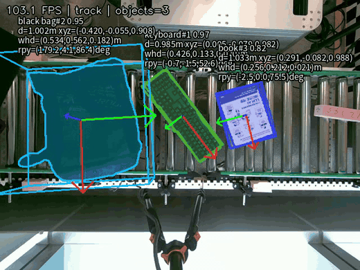
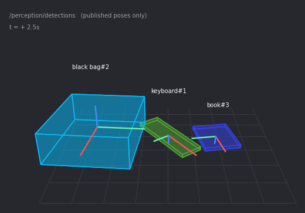
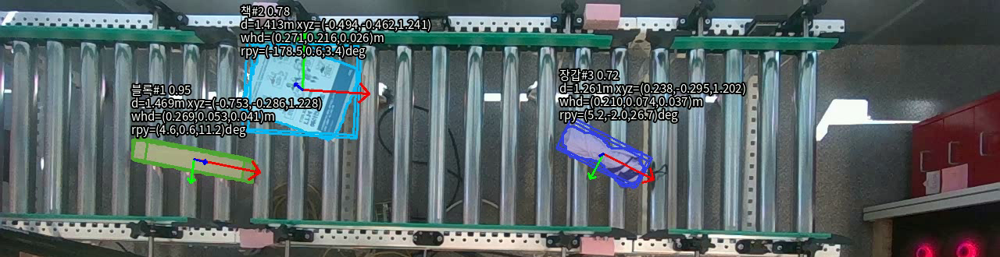
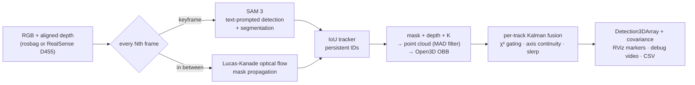
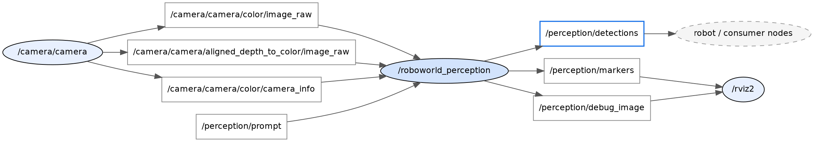

<div align="center">

# pose-anything

**Zero-shot object detection, tracking, and 6-DoF pose estimation on ROS 2.**

*SAM 3 · Open3D · no training · no CAD models*

[](https://github.com/facebookresearch/sam3)
[](https://docs.ros.org/en/jazzy/)
[](#requirements)
[](#requirements)
[](http://www.open3d.org/)
[](LICENSE)

</div>

<table>
<tr>
<td width="56%"></td>
<td width="44%"></td>
</tr>
</table>

<sub>**Same 10 seconds, two views.** Left — the debug overlay: three prompted objects
(`black bag`, `keyboard`, `book`) tracked with masks, 3D boxes, and local axes; when a
look-alike occluder sweeps over them, the last good box is held greyed-out instead of
being corrupted. Right — what a robot actually receives on `/perception/detections`:
during occlusion the unreliable pose is **withheld entirely** (a per-track Kalman filter
χ²-rejects the corrupted observations), and publishing resumes the moment the object
reappears — same track IDs throughout.</sub>



<sub>**Moving conveyor, three text prompts** (`블록`/block, `책`/book, `장갑`/glove) — each object keeps
a single track ID for the entire 20-second sequence with zero axis flips. Estimated OBB sizes
are self-consistent across frames; absolute size is validated only on the Isaac
scene, where the USD model gives ground truth (docs/image_size_2026-08-21.md).</sub>

## How it works



Running the 848M-parameter SAM 3 on every frame caps throughput at ~3 FPS.
The hybrid scheme runs it only on keyframes (default: every 5th frame) and tracks
masks with optical flow in between, reaching **~9 FPS** on an RTX 4070 Ti —
while the 3D pose is still recomputed **every frame** from that frame's real depth.

Since OBB axes are arbitrary up to permutation and sign, the stabilizer matches each
new OBB against the previous frame's axes, ignores sub-2° jitter (deadband), and
slerps the rest — bringing yaw noise down from 3.5° to **0.94° per frame** with zero
90°/180° axis flips.

Observation quality is judged by a **per-track probabilistic filter** rather than
hand-tuned thresholds: each track runs a small constant-velocity Kalman filter over
its center and size, and every observation must pass a χ² gate against the track's
own state and learned noise level. A corrupted observation — an occluder intruding
in depth, a look-alike object overlapping at the same height, a half-visible mask —
is rejected and the last good pose is kept (drawn greyed out; publishing stops 0.5 s
after the last accepted observation, so stale poses never reach a consumer). Because
rejections grow the filter's uncertainty, the gate re-opens on its own: a genuine
change is re-accepted within ~2 s while a large occluder stays rejected far longer
than any real occlusion lasts — the system cannot deadlock into a permanently
"occluded" state. Frozen tracks are re-identified on reappearance, and every
published pose carries its position uncertainty in `PoseWithCovariance` so a robot
can gate grasping on confidence.

## Measured results

Validated on self-recorded rosbags (13 s static / 20 s moving conveyor, not included in this repo):

| Metric | Result |
|---|---|
| Track ID persistence (3 moving objects, 20 s) | single ID each, 0 axis flips |
| OBB size — Isaac scene (USD ground truth 200x55x55 mm) | footprint −4 to −8 mm, thickness +3.2 mm |
| OBB size vs. real objects (test2/test3) | **not validated** — no measured ground truth for those bags yet |
| Center jitter (static objects) | ≤ 1.5 mm std *(within a run; the support plane is fitted once and cached, so plane error does not appear in this figure — run-to-run plane spread is 0.40 mm on the Isaac scene and 13 mm on test2)* |
| Yaw jitter | 0.94°/frame avg, 0% jumps > 5° |
| Occlusion robustness (hand/object passing over, 29 events) | IDs survive all occlusions; stale poses suppressed; pose resumes ≈ 0.3 s (median) after reappearance |
| Throughput (3 prompts, RTX 4070 Ti) | ~9 FPS |

## Requirements

**With Docker** the host only needs an NVIDIA driver, Docker + nvidia-container-toolkit,
and a Hugging Face account — everything below ships inside the image. For native installs:

- Ubuntu 24.04 (verified on WSL2) with **ROS 2 Jazzy**
- NVIDIA GPU with ≥ 6 GB VRAM, PyTorch CUDA build (bf16 inference)
- Python 3.12 — `transformers>=5.5`, `open3d`, `rosbags`, `scipy`, `opencv-python`
- Intel RealSense D455 + [`realsense2_camera`](https://github.com/IntelRealSense/realsense-ros) for live input
- A Hugging Face account with access to the gated
  [`facebook/sam3`](https://huggingface.co/facebook/sam3) checkpoint
  (click *"Agree and access repository"* on the model page — approval is immediate)

## Quick start

### Docker (recommended — any Ubuntu PC with an NVIDIA GPU)

Requires Docker and [nvidia-container-toolkit](https://docs.nvidia.com/datacenter/cloud-native/container-toolkit/latest/install-guide.html).

```bash
git clone https://github.com/ingon1026/pose-anything.git
cd pose-anything
export HF_TOKEN=hf_xxxx            # token of an account with facebook/sam3 access
docker compose run --rm perception                                    # live camera
docker compose run --rm perception ./run.sh bags/mybag --prompts "book"   # rosbag
```

The prebuilt image is pulled from
[Docker Hub (`ingon1026/pose-anything`)](https://hub.docker.com/r/ingon1026/pose-anything)
on first run — no local build needed. To build from source instead: `docker compose build` (~21 GB).

Model weights are **not** baked into the image (Meta's gated license) — they are
downloaded once on first run into a mounted cache volume and reused afterwards.
Put rosbags under `./bags/` (mounted into the container); add `--headless` on
machines without a display.

### Native install

```bash
git clone https://github.com/ingon1026/pose-anything.git
cd pose-anything
pip install --user --break-system-packages \
    torch torchvision --index-url https://download.pytorch.org/whl/cu128
pip install --user --break-system-packages \
    "transformers>=5.5" open3d rosbags scipy opencv-python pillow
hf auth login                      # account with facebook/sam3 access
colcon build --symlink-install
```

```bash
./run.sh                           # live RealSense camera
./run.sh path/to/rosbag            # play a recorded bag
./run.sh path/to/rosbag --prompts "book,glove"   # non-interactive
```

The script asks one question — which objects to find. Type a name like `book`
(or a Korean alias like `책`) and **only the prompted objects are detected and
tracked** — one best-scoring instance per prompt, with a persistent track ID.
Everything else in the scene is ignored.

It then starts the perception node, RViz (preset with 3D boxes and axes), and a
full-size debug window. Per-frame results are logged to `output/ros_<timestamp>.csv`.

Offline processing (no ROS runtime — reads the bag directly, writes mp4 + CSV):

```bash
python3 scripts/run_offline.py --bag path/to/rosbag --prompts "book" --show
```

### Prompts

SAM 3's text encoder is English-based. These Korean words are translated
automatically (see `PROMPT_ALIASES` in `sam3_detector.py`); use English for
anything else:

> 물통 · 마우스 · 필통 · 노트북 · 책 · 스마트폰 · 장갑 · 천 · 블록

**If detection is unstable, change the word before touching the threshold.**
The same green thermos scores 0.45 as `"water bottle"` but 0.91 as `"thermos"`.
Prompts can be swapped at runtime:

```bash
ros2 topic pub --once /perception/prompt std_msgs/String "data: thermos"
```

## ROS 2 interface



**Subscribes** — `/camera/camera/color/image_raw`, `/camera/camera/aligned_depth_to_color/image_raw`,
`.../camera_info`, `/perception/prompt`

**Publishes**

| Topic | Type | Content |
|---|---|---|
| `/perception/detections` | `vision_msgs/Detection3DArray` | label, score, track ID, geometric OBB pose, size, covariance — in the camera optical frame reported by `camera_info` |
| `/perception/markers` | `visualization_msgs/MarkerArray` | OBB cube, XYZ axes, label text for RViz |
| `/perception/debug_image` | `sensor_msgs/Image` | mask + 3D box + status overlay |
| `/perception/status` | `diagnostic_msgs/DiagnosticArray` | 1 Hz RGB-D heartbeat: CameraInfo/input-contract validity, last-frame age, last processing duration, and out-of-order-frame drops; `ERROR` for contract failures, `WARN` for absent/stale input |

**Parameters** — `prompts`, `detect_interval` (5, SAM keyframe period),
`max_per_prompt` (1, tracks per prompt), `csv_path`, `display`,
`publish_world_tf` (false — never enable this nominal RViz-only TF for robot
coordinates; supply a calibrated camera-to-world/base TF externally instead),
`input_qos_depth` (1 — keep only the newest RGB/depth image per stream when
inference is slower than the camera), `use_sim_time` (false for normal
camera/bag launches; `isaac.launch.py` sets it true for both perception and RViz)

`score_threshold` (0.4) is **not** a publish threshold. The detector itself
returns everything above `min(0.1, score_threshold)`; the value only decides
which detections are strong enough to *start a new track* (and which go to the
ByteTrack low-score second pass). A track that is kept alive by low-score
observations keeps publishing, and its `score` field follows those low
observations down — that is deliberate, since low-score matches are what carry
a track through partial occlusion.

`publish_score_min` (0.0 = off) is the actual publish gate, for scenes where
persistent low-score fragments would otherwise reach a consumer. It is an
absolute threshold, so a track sitting near the value flickers in and out —
set it well below the scores you expect. `launch/isaac.launch.py` sets 0.6.

What a consumer actually receives (captured from a real run — the per-axis
position variance is filled in by the fusion filter. The OBB quaternion is for
geometric visualisation, not a calibrated semantic orientation; its roll,
pitch, yaw covariance diagonals are conservatively set to \(\pi^2\) rad²
(180° 1σ), so an orientation-gated grasp must reject it unless a separate
orientation estimator is added):

```yaml
# ros2 topic echo /perception/detections --once   (truncated)
detections:
- results:
  - hypothesis: {class_id: black bag, score: 0.914}
    pose:
      pose:
        position: {x: -0.488, y: 0.053, z: 0.894}
        orientation: {x: -0.112, y: -0.103, z: -0.641, w: 0.753}
      covariance: [7.7e-05, 0, 0, ..., 2.7e-04, ..., 2.8e-05, ..., 9.87, ..., 9.87, ..., 9.87]  # σxyz=8.8/16.5/5.3mm; σrpy=180° (unestimated)
  bbox: {size: {x: 0.462, y: 0.529, z: 0.180}}
  id: black bag#2
```

## Project structure

```
src/roboworld_perception/         ROS 2 package (ament_python)
  roboworld_perception/
    sam3_detector.py              SAM 3 wrapper, prompt aliases
    pipeline.py                   hybrid detect/track orchestration
    tracker.py                    IoU association, track lifecycle, rotation stabilization
    fusion.py                     per-track Kalman filter + χ² observation gating
    geometry.py                   back-projection, OBB, axis matching
    overlay.py                    debug rendering
    perception_node.py            ROS 2 node
  rviz/perception.rviz            RViz preset
  test/                           pytest, 40 cases incl. filter property tests
scripts/run_offline.py            bag → mp4/CSV without ROS
run.sh                            single entry point
```

## Acknowledgments

This project builds on the following open-source work:

- **[SAM 3 — Segment Anything with Concepts](https://ai.meta.com/research/publications/sam-3-segment-anything-with-concepts/)**
  (Meta AI) — open-vocabulary detection, segmentation, and tracking.
  Used via [Hugging Face Transformers](https://github.com/huggingface/transformers)
  (`Sam3Model`). Model weights are **not** distributed with this repository; they are
  downloaded from [`facebook/sam3`](https://huggingface.co/facebook/sam3) under Meta's
  own license terms after gated-access approval.
- **[Open3D](http://www.open3d.org/)** (Zhou, Park, Koltun) — point-cloud processing
  and oriented-bounding-box estimation.
- **[ROS 2](https://docs.ros.org/en/jazzy/)** / **[vision_msgs](https://github.com/ros-perception/vision_msgs)** — middleware and message definitions.
- **[librealsense / realsense-ros](https://github.com/IntelRealSense/realsense-ros)** (Intel) — D455 camera driver.
- **[OpenCV](https://opencv.org/)** — optical flow, rendering; **[SciPy](https://scipy.org/)** — rotation math.

## License

Code in this repository is released under the [MIT License](LICENSE).
The SAM 3 model weights are governed by Meta's separate license (see above).
