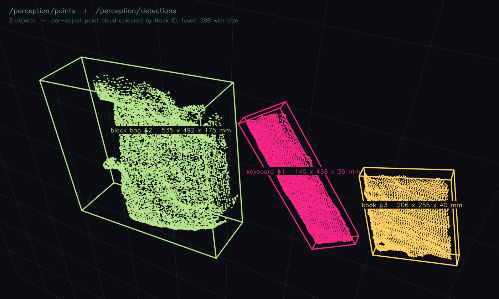
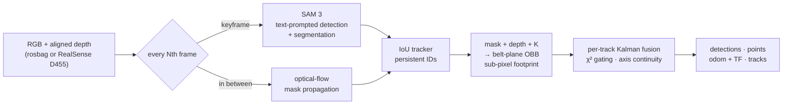

<div align="center">

# pose-anything

**Zero-shot object detection, tracking, and 6-DoF pose on ROS 2 — for picking.**

*Type a word. Get poses, sizes, point clouds, velocities, and occlusion state on ROS 2 topics. No training, no CAD.*

[](https://github.com/facebookresearch/sam3)
[](https://docs.ros.org/en/jazzy/)
[](docs/install.md)
[](docs/install.md)
[](http://www.open3d.org/)
[](https://hub.docker.com/r/ingon1026/pose-anything)
[](LICENSE)

</div>

<table>
<tr>
<td width="50%"></td>
<td width="50%"></td>
</tr>
<tr>
<td width="50%"></td>
<td width="50%"></td>
</tr>
</table>

<sub>**Top-left** debug overlay — three text prompts, masks + 3D boxes; a look-alike sweeps over them and the last good pose is held greyed-out, not corrupted. **Top-right** what a robot actually receives — the unreliable pose is withheld and comes back with the same ID. **Bottom-left** `/perception/points` — per-object point clouds coloured by track ID, with the fused box and its size. **Bottom-right** moving conveyor, `블록`/`책`/`장갑` — one ID each for 20 s, zero axis flips.</sub>

## What you get

One node, one text prompt per object class. Everything a picking controller needs comes out as standard ROS 2 messages:

| Topic | Type | What it carries |
|---|---|---|
| `/perception/detections` | `vision_msgs/Detection3DArray` | pose, size, covariance, label, score, track ID — **never a stale pose** |
| `/perception/points` | `sensor_msgs/PointCloud2` | this frame's points of each object, coloured by track ID |
| `/perception/odom` + TF `obj_<id>` | `nav_msgs/Odometry` | per-object velocity for lead on a moving belt; a TF frame per object |
| `/perception/tracks` | `diagnostic_msgs/DiagnosticArray` | `visible` · `held` · `pending` · `occluded` · `lost` — tells you whether a missing object is *occluded* or *gone*, and why |
| `/perception/debug_image` · `/perception/markers` | `Image` · `MarkerArray` | overlay for humans, boxes and axes for RViz |

Full field semantics, parameters, and the withdrawal contract: [`docs/ros2_interface.md`](docs/ros2_interface.md).

## Quick start

```bash
git clone https://github.com/ingon1026/pose-anything.git && cd pose-anything
export HF_TOKEN=hf_xxxx                          # facebook/sam3 is gated — accept once on Hugging Face
docker compose run --rm perception               # live RealSense D455
docker compose run --rm perception ./run.sh bags/my.bag --prompts "book"   # or a rosbag
```

The image is pulled from Docker Hub on first run; SAM 3 weights download once into a cache volume. Native install, arm64 (DGX Spark), Isaac Sim, and everything that bites: [`docs/install.md`](docs/install.md).

## Measured

| | Result |
|---|---|
| Footprint, Isaac scene (true 200 × 55 mm) | **W 56.05 · L 204.7 mm** — sub-pixel contour footprint, `image_size` 672, 300 frames |
| Thickness, Isaac scene (true 54.5 mm above the belt) | **+1.97 mm** — `image_size` 1008, 500 frames |
| Size on real objects | **not validated** — no ground truth measured yet |
| Track IDs, 3 objects on a moving belt, 20 s | one ID each, 0 axis flips |
| Occlusion, 29 hand / object pass-overs | IDs survive, stale poses withheld, pose resumes ≈ 0.3 s after reappearance |
| Yaw jitter | 0.94° per frame |
| Throughput, RTX 4070 Ti, `image_size` 1008, keyframe every 5 frames | 7.7 – 12.4 FPS in the pipeline |

Every number above was measured under one condition and does not transfer to another — each one is traced to its bag, resolution, and commit in [`docs/`](docs/README.md).

## How it works



SAM 3 runs on keyframes and optical flow carries the masks in between, so an 848M-parameter model fits a real-time loop. Each track owns a small Kalman filter; an observation that fails its χ² gate (an occluder, a look-alike, a half-visible mask) is rejected and the last good pose is kept — and withheld from `/perception/detections` after 0.5 s, so a robot never acts on a stale pose. The footprint is measured on SAM 3's probability field at sub-pixel resolution instead of counting mask pixels.

## Docs

- [`docs/install.md`](docs/install.md) — requirements, Docker / native / arm64, regression gate before shipping
- [`docs/ros2_interface.md`](docs/ros2_interface.md) — every topic, parameter, and what a consumer must not assume
- [`docs/README.md`](docs/README.md) — index of the investigation notes: belt-plane OBB, sub-pixel footprint, fusion filter, occlusion, Isaac Sim, shared-server ops

## Acknowledgments

[SAM 3](https://ai.meta.com/research/publications/sam-3-segment-anything-with-concepts/) (Meta AI, via [Transformers](https://github.com/huggingface/transformers); weights under Meta's license, gated) · [Open3D](http://www.open3d.org/) · [ROS 2](https://docs.ros.org/en/jazzy/) / [vision_msgs](https://github.com/ros-perception/vision_msgs) · [realsense-ros](https://github.com/IntelRealSense/realsense-ros) · [OpenCV](https://opencv.org/) · [SciPy](https://scipy.org/)

## License

MIT — see [LICENSE](LICENSE). SAM 3 weights are governed by Meta's separate license.
