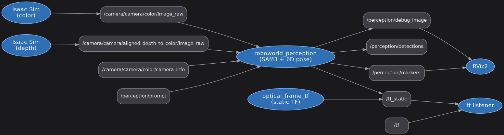

# Isaac Sim 연동 안정화 (2026-08-14)

어제([isaac_sim_connection_2026-08-13.md](isaac_sim_connection_2026-08-13.md))
연결한 Isaac Sim ↔ `roboworld_perception` 파이프라인을 하루 돌려보며 나온
고장을 정리했다. 코드 수정 3 커밋(`715fd18`, `76014fc`, `c6e3874`)이 들어갔다.

이 문서는 **"증상 → 진짜 원인 → 조치"** 순으로 적었다. 오늘 증상만 보고
엉뚱한 곳을 여러 번 팠기 때문에, 같은 길로 다시 들어가지 않도록 **틀렸던
가설도 함께 남긴다.**

---

## 0. 한 줄 요약

이미지 토픽이 죽는 진짜 원인은 네트워크도 QoS 도 아니고 **VRAM 고갈로 인한
CUDA 핸들 무효화**다. Isaac Sim + SAM3 + RViz 를 12 GB GPU 하나에 올리면
넘친다.

### 오늘 시점의 실제 연결



`rqt_graph` 는 미설치라(`sudo apt install ros-jazzy-rqt-graph`) 살아있는
그래프를 rclpy 로 조회해 graphviz 로 그렸다. Isaac 의 SDG 라이터 노드 이름은
`_Render_PostProcess_SDGPipeline_Replicator_01_NodeWriterWriter_02` 처럼
기계적이고 그래프를 다시 만들 때마다 접미사가 바뀌므로, **이름이 아니라
발행하는 토픽으로** 판별해 `Isaac Sim (color/depth/camera_info)` 로 표기했다.

---

## 1. 이미지 토픽이 통째로 죽는다 ← 오늘의 본체

### 증상

- Isaac 뷰포트는 멀쩡히 30~37 FPS 로 돌아간다.
- `ros2 topic list` 에 카메라 토픽 3 개가 다 보인다.
- `camera_info`(작은 메시지)는 오는데 **이미지만 0 장**.
- 재시작 말고는 복구가 안 된다. 타임라인 stop/play 도 안 통한다.

### 진짜 원인

Isaac 로그(`~/.nvidia-omniverse/logs/Kit/Isaac-Sim Full/6.0/kit_*.log`)에:

```
[isaacsim.ros2.nodes] CUDA error 400: cudaErrorInvalidResourceHandle
  at isaacsim.ros2.nodes\nodes\OgnROS2PublishImage.cpp:466
```

VRAM 이 모자라면 렌더프로덕트 텍스처가 재할당되고, 그 순간 ROS2 발행 노드가
들고 있던 CUDA 핸들이 무효가 된다. 그 뒤로 **매 프레임 실패**한다.
`camera_info` 는 CPU 에서 만들어 보내므로 혼자 살아남는다 — 이 비대칭이
"토픽은 보이는데 이미지만 없다" 의 정체다.

실측: 최초 발생이 SAM3 기동 직후였다. 하루 누적 **23,410 회**.

### 조치

`image_size` 파라미터를 노출해 SAM3 입력을 **1008 → 672 px** 로 낮췄다.
카메라가 640x360 이라 1008 은 어차피 업스케일이었다.

```bash
ros2 launch roboworld_perception perception.launch.py image_size:=672
```

결과: 같은 워크로드에서 **23,410 회 → 0 회**, 4 분 연속 녹화 완주.

### ⚠️ 이건 완치가 아니다

여유를 만들어준 것뿐이다. 부하를 다시 올리면 재발한다. 실측:

| 구성 | CUDA 에러 |
|---|---|
| Isaac + SAM3(`detect_interval=8`), RViz 없음 | 0 회 |
| Isaac + SAM3(`detect_interval=1`) + RViz | **37,151 회 → GPU 크래시** |

마지막 조합에서는 `[omni.rtx] GPU crash is detected` 와 함께 Isaac 이
SIGSEGV(139)로 죽었다.

**근본 대책은 VRAM 확보다.** RTX 4070 Ti 12.3 GB 중 Chrome·Notion·PowerPoint
·Docker 가 이미 5.3 GB 를 잡고 있어 남는 7 GB 로 셋을 감당할 수 없다.
작업 전에 브라우저부터 닫는 것이 가장 효과가 크다.

---

## 2. 틀렸던 가설들 (같은 길로 다시 가지 말 것)

증상이 "이미지만 안 온다" 였기 때문에 전송 계층을 오래 팠다. **전부 아니었다.**

| 의심한 것 | 왜 아니었나 |
|---|---|
| WSL2 커널 소켓 버퍼 208 KB < 이미지 675 KB | `sysctl net.core.rmem_max=16777216` 올려도 전송률 그대로 |
| 웹 콘솔이 카메라를 경합 | `console_only.py` 로 바꿔도 그대로 |
| 뷰포트 캡처가 렌더를 굶김 | 캡처를 멈춰도 그대로 |
| FastDDS 버퍼 프로파일 미적용 | 프로파일 걸어도 차이 없음 |
| Isaac 뷰포트가 VRAM 을 먹는다 | 해상도를 16 배 줄여도, 렌더링을 통째로 꺼도 안 줄어든다 (8/19 실측, 아래) |

**교훈: 이미지만 죽고 `camera_info` 는 살아 있으면 전송이 아니라 GPU 를 봐라.**
Isaac 로그의 `[Error]` 를 먼저 grep 하면 5 분 만에 끝난다.

```bash
grep -c cudaErrorInvalidResourceHandle "$(ls -t ~/.nvidia-omniverse/logs/Kit/Isaac-Sim\ Full/6.0/kit_*.log | head -1)"
```

**단, 반대 함정도 있다.** 이미지가 두 개 다 흐르는데 검출만 0 이면 GPU 가
아니라 동기화기다 (§3). 8/19 에 여기서 반나절을 썼다.

---

## 3. 검출이 하나도 안 나온다 — 동기화 slop ← 8/19 의 본체

### 증상

- `perception_node` 가 `입력 없음 5.0초 — 마커 정리` 만 반복한다.
- `ros2 topic list` 에 color/depth/`camera_info` 가 다 보이고 `camera_info` 도
  정상이다. 이미지도 실제로 흐른다.
- 그런데 검출은 **0 개**. 콜백이 아예 안 불린다.

### 진짜 원인

`perception_node.py` 가 두 이미지를 묶는 동기화기를 하드코딩하고 있었다.

```python
ApproximateTimeSynchronizer(..., queue_size=5, slop=0.05)
```

color 와 depth 는 **서로 다른 틱에서 각각 따로 유실된다.** 발행률이 낮으면
살아남은 프레임끼리 스탬프가 50 ms 안에 겹칠 일이 거의 없다. 두 스트림이
다 살아 있어도 짝이 안 붙으면 콜백은 한 번도 안 불린다.

실측 (2026-08-19, 40 초):

| 항목 | 값 |
|---|---|
| color 수신 | 19 장 |
| depth 수신 | 11 장 |
| 동기화 성공 | **2 회** |
| 가장 가까운 짝의 시간차 | 0.0333 초 (임계 0.05 초에 아슬아슬) |

서른 장을 받고 두 번 붙었다. `slop=0.05` 는 두 스트림이 30 Hz 로 나란히 오는
**bag 재생 기준값**이지 실시간 Isaac 기준값이 아니다.

### 조치 — `sync_slop` / `sync_queue_size` 파라미터화 (`5f881d0`)

**기본값은 0.05 / 5 그대로 둔다.** bag 재생은 촘촘해서 문제가 없고, slop 을
무턱대고 넓히면 서로 다른 순간의 프레임을 잘못 묶는다. Isaac 프리셋
(`isaac.launch.py`)에서만 올렸다.

| 파라미터 | 기본 | Isaac 프리셋 |
|---|---|---|
| `sync_slop` | 0.05 | **1.0** |
| `sync_queue_size` | 5 | **30** |

1.0 초는 Isaac 입력 주기(2 초)의 절반이다. 짝은 안정적으로 붙으면서 다른
순간을 묶을 위험은 낮은 지점으로 골랐다. `queue_size` 는 두 스트림의 발행률이
다를 때(color 0.5 Hz / depth 0.3 Hz) 느린 쪽을 기다리는 동안 빠른 쪽 큐가
밀려나는 것을 막는다.

수정 후 실기동:

| 항목 | 값 |
|---|---|
| `/perception/detections` | 0.78 Hz |
| `/perception/debug_image` | 0.61 Hz |
| 검출 score | 0.945 |
| pose z | 0.945 m |
| 크기 | 0.194 x 0.049 m |
| RViz2 마커 | 정상 |
| Kit CUDA 에러 | 0 건 |

### 이것이 "안정 구성" 이 실기동에서 안 돌던 이유다

이 문서가 8/18 에 안정 구성이라고 적어 둔 `isaac.launch.py` 프리셋은, 그대로
띄우면 검출이 하나도 안 나왔다. VRAM 도 CUDA 에러도 아니고 동기화기였다.
안정 구성이라는 표시는 "CUDA 에러가 안 난다" 까지만 보증한 것이었다.

**교훈: "토픽은 흐르는데 입력 없음" 이 나오면 VRAM 을 의심하기 전에
동기화기를 직접 붙여서 짝이 붙는지부터 재라.**

재현 — 같은 `ApproximateTimeSynchronizer(queue_size=5, slop=0.05)` 를 붙인
작은 노드로 color/depth 스탬프를 모아, 수신 장수와 최근접 짝의 시간차를 찍어
보면 된다. **5 분이면 판정된다.** 장수는 도는데 시간차가 slop 보다 크게
나오면 그게 전부다.

---

## 4. TF 사슬이 끊겨 RViz 에 마커가 안 보인다

### 원인

검출은 `camera_color_optical_frame` 기준으로 발행되는데, `perception_node` 는
`world -> camera_link` 만 발행한다. 그 사이 링크
`camera_link -> camera_color_optical_frame` 은 **RealSense 드라이버가 채우는
것**이라, Isaac 이 이미지를 직접 쏘는 구성에는 아무도 안 보낸다.

### 조치 — `publish_optical_tf` 파라미터 (기본 `False`)

```bash
ros2 launch roboworld_perception perception.launch.py publish_optical_tf:=true
```

**Isaac 구성에서는 반드시 켜야 한다.** 기본값을 `False` 로 둔 이유는 실패
모드가 비대칭이기 때문이다:

- 잘못 **켜면**(bag 재생): 녹화된 RealSense 트리와 부모가 둘이 되어 멀쩡하던
  TF 가 깨진다. 증상이 엉뚱한 곳에 나타나 원인 찾기가 어렵다.
- 잘못 **끄면**(Isaac): 마커만 안 보이고, 해결은 인자 한 줄이다.

### 구현 주의 — 정적 TF 는 리스트로 한 번에

`StaticTransformBroadcaster` 의 발행자 QoS 는 `depth=1` + `TRANSIENT_LOCAL`
이라 **늦게 켠 구독자는 마지막 메시지 하나만** 받는다. `sendTransform` 을
나눠 부르면, 누적 재발행하지 않는 구현에서는 먼저 보낸 변환이 통째로 사라진다.
그래서 두 변환을 리스트로 묶어 한 번에 보낸다.

검증: `/tf_static` 에 `world -> camera_link -> camera_color_optical_frame`
두 줄이 한 메시지로 나오는 것을 실기동에서 확인했다.

### 남은 약점

`child_frame_id` 가 하드코딩이다. 정적 TF 는 `__init__` 에서 한 번 발행하는데
`camera_info` 는 나중에 오므로 이름을 기다릴 수 없다. Isaac 이 다른 optical
frame 이름을 실어 보내면 이 링크는 붙지 않는다.

---

## 5. launch 인자가 조용히 무시된다 ← 함정

노드가 `declare_parameter` 로 갖고 있어도, `perception.launch.py` 의
`parameters=[{...}]` 에 넣지 않으면 **launch 인자로 줘도 무시되고 노드
기본값이 남는다. 에러도 안 난다.**

실제로 이것 때문에 `max_per_prompt:=12` 를 줬는데 기본값 `1` 이 남아,
블록 9 개가 놓인 장면에서 **1 개만 검출되는 것**으로 보였다. 성능 문제로
오해하기 딱 좋다.

이제 넘어가는 인자 (전부 `ParameterValue` 로 형변환 필요 — 치환값은 문자열):

| 인자 | 기본 | 비고 |
|---|---|---|
| `max_per_prompt` | 1 | 같은 물체 여러 개면 반드시 올릴 것 |
| `detect_interval` | 5 | 입력이 느리면 낮춰야 트랙이 선다 (아래) |
| `stale_timeout` | 5.0 | 마커 잔상 정리 임계값 |
| `sync_slop` | 0.05 | 입력이 느리면 반드시 올릴 것 (§3) |
| `sync_queue_size` | 5 | 두 스트림 발행률이 다르면 올릴 것 (§3) |
| `image_size` | 0 | 0 = SAM3 기본 1008px |
| `publish_optical_tf` | false | Isaac 구성은 true |

확인 방법:

```bash
ros2 param get /roboworld_perception max_per_prompt
```

---

## 6. RViz 마커 깜빡임

원인이 둘이었다.

1. **`_watchdog` 임계값 2.0 초 하드코딩.** bag 재생 기준이라 실시간에는 너무
   짧다. Isaac 실시간 입력은 3~4 초 공백이 예사라 **정상 동작 중에도** 매번
   `DELETEALL` 이 나가 마커가 통째로 사라졌다 나타났다.
   → `stale_timeout` 파라미터로 분리.
2. **`publish()` 가 매 사이클 `DELETEALL` 을 앞세웠다.** RViz 가 지움과 다시
   그림 사이를 렌더링해 번쩍인다.
   → 같은 `ns`/`id` 로 덮어쓰게 두고, 직전에 있다가 사라진 것만 골라 `DELETE`.

---

## 7. 라벨이 안 읽힌다 (2 건)

**가로 잘림** — 라벨은 박스 왼쪽 x 에서 시작해 그려지는데 경계 처리가 없어
`whd=(0.161,0.057,0.0` 처럼 중간에서 끊겼다. `_label_x` 로 가장 넓은 줄 기준
클램프. 폭은 `textlength` 가 아니라 **`textbbox(stroke_width=2)`** 로 잰다 —
실측 238.8 vs 241 로 stroke 번짐만큼 과소평가되어 2 px 씩 다시 잘린다.

**세로 겹침** — 컨베이어처럼 같은 높이에 물체가 늘어서면 박스 y 가 전부 같아
라벨이 한 자리에 쌓인다(블록 7 개 기준 통째로 뭉갬). 화면 왼→오른쪽 순으로
3 단 계단 배치. `track_id` 순으로 매기면 인접 물체가 같은 단에 걸린다.

> ⚠️ 가로 잘림 수정은 **화면으로 확인하지 못했다.** 코드 레벨 렌더 테스트만
> 통과한 상태에서 GPU 가 크래시했다. 다음 세션에서 눈으로 볼 것.

---

## 8. 운영 규칙 (밟으면 시간 날림)

### `stop → play` 를 쓰지 말 것

SDG 파이프라인 전체를 해제했다 재구성하느라 **메인 스레드가 1~13 분 멈춘다**
(실측: 20 회 폴링 만에 응답). 메모리가 6.9 GB → 2.0 GB 로 떨어졌다 다시 오르는
것이 그 과정이다.

**블록 위치를 초기화하려면 Isaac 재기동이 더 빠르다** — 16 초에 뜨고 씬을
새로 열면 배치도 원상복구된다.

### Isaac 그래프를 재생성하면 perception 을 재시작할 것

`stop→play` 나 `cellomni_ros2_rebuild.py` 는 ROS2 퍼블리셔를 **파괴하고 새로
만든다.** 그 전에 떠 있던 구독자는 재매칭되지 않는다. 증상은 "토픽은 보이는데
perception 은 입력 없음" 이다. 새로 만든 구독자는 잘 받으므로 진단이 헷갈린다.
또한 같은 문구가 동기화 slop 때문에도 나온다 — perception 을 새로 띄워도
그대로면 §3 을 볼 것.

### 해상도 변경은 세션당 한 번만

`cellomni_ros2_rebuild.py` 를 같은 세션에서 두 번 돌리면 `DeletePrims` 로
지워도 옛 SDG 라이터의 퍼블리셔가 살아남아 **옛 해상도의 K 를 계속 뿌린다.**
구독자가 먼저 온 것을 캐시하면 결과가 정확히 절반이 되는데 에러가 안 난다.

```bash
ros2 topic info /camera/camera/color/camera_info --verbose --no-daemon | grep "Publisher count"
# 반드시 1
```

### 입력이 느리면 `detect_interval` 을 낮출 것

입력 0.2 Hz 에 `detect_interval=8` 이면 SAM3 가 **40 초에 한 번** 돈다.
추적기를 그보다 자주 리셋하면 트랙이 설 틈이 없어 검출이 0 이 된다.
실측: `detect_interval=8` → 평균 0.1 개, `=1` → 평균 4.7 개.

### `ros2 topic hz` 는 `--no-daemon` 을 안 받는다

`list`/`echo` 는 받는다. `hz` 에 붙이면 usage 에러만 내고 조용히 죽어서
"토픽이 안 나온다" 로 보인다. 저속(0.2 Hz)에서는 창이 안 차 아무것도 못 내므로
직접 세는 편이 낫다.

### `.bashrc` 가 RMW 를 두 번 export 한다 (미수정)

`~/.bashrc` 가 같은 변수를 여섯 줄 간격으로 두 번 설정한다. **나중 것이 이긴다.**

```
134:export RMW_IMPLEMENTATION=rmw_fastrtps_cpp
140:export RMW_IMPLEMENTATION=rmw_cyclonedds_cpp
```

그래서 터미널을 열어 손으로 띄운 노드는 전부 `rmw_cyclonedds_cpp` 다. 반면
Windows 쪽(`cellomni 실행.bat`)은 `rmw_fastrtps_cpp` 고정이다
([2026-08-13 §4.2](isaac_sim_connection_2026-08-13.md)). **RMW 가 다르면
DDS 가 서로를 아예 못 본다.**

오늘 검증에 안 걸린 이유가 있다. `wsl -e bash -lc` 같은 **비대화형 셸은
`.bashrc` 를 읽지 않아서** 변수가 비고, ROS 2 기본값인 `rmw_fastrtps_cpp` 로
뜬다. 즉 **스크립트로 돌리면 붙고, 사용자가 터미널에서 직접 띄우면 안 붙는다.**
같은 명령인데 결과가 달라서 원인 찾기가 나쁘다.

```bash
grep -n RMW_IMPLEMENTATION ~/.bashrc
bash -lc 'echo "login: $RMW_IMPLEMENTATION"'       # 비어 있음 -> fastrtps
bash -ic 'echo "interactive: $RMW_IMPLEMENTATION"' # rmw_cyclonedds_cpp
```

**아직 안 고쳤다.** 어느 줄을 지울지는 이 머신의 다른 노드들이 어느 RMW 를
전제하는지 확인한 뒤에 정한다. 고치기 전까지는 Isaac 과 붙일 셸에서
`export RMW_IMPLEMENTATION=rmw_fastrtps_cpp` 를 손으로 다시 걸 것.

---

## 9. 실측 성능 (참고)

640x360 기준, 카메라 → WSL 수신률:

| 구성 | color | depth | 5 초 초과 공백 |
|---|---|---|---|
| Isaac 단독 | 2.33 Hz | 1.37 Hz | 0 회 |
| + 웹 콘솔 | 1.53 Hz | 1.87 Hz | 1 회 |
| + SAM3 | 0.50 Hz | 0.50 Hz | 1 회 |

Isaac 자체는 내내 11~12 FPS 로 렌더링한다. 병목은 네트워크가 아니라
**같은 GPU 를 나눠 쓰는 것**이다.

검출 정확도(정답 대비, 가림 없는 블록):

```
x  0 ~ 4 mm      y  0 ~ 1 mm      z  0 ~ 1 mm
```

로봇 팔에 가린 블록은 마스크가 잘려 중심이 밀리고(-24 mm) depth 중앙값이
팔 표면을 물어 z 가 뜬다(-30 mm). 알고리즘 편향이 아니라 가림이다.

두께는 항상 0 에 가깝게 나온다 — 위에서만 보면 윗면만 보이므로 단일 시점
depth 의 구조적 한계다.

---

## 10. 다음 세션에서 할 것

2026-08-18 에 아래 다섯 개를 처리했다.

- [x] 라벨 가로 잘림 수정을 **화면으로** 확인 — 정상. 오른쪽 끝 라벨의
      `whd=(...)` 괄호가 닫히는 것을 실기동에서 봤다.
- [x] 세로 겹침은 **미해결이었다.** 3 단 계단으로 적어 뒀지만 블록 9 개에서는
      0·3·6 번이 같은 단에 걸려 글자가 섞였다. 고정 단수를 버리고 빈자리를
      찾는 방식으로 교체 (`6a24e7c`).
- [x] Isaac 프리셋 → `isaac.launch.py` (`d297d32`)
- [x] `child_frame_id` 하드코딩 분리 → `world_frame` / `camera_link_frame` /
      `optical_frame` (`77ba137`)
- [x] `overlay.py` 테스트 14 개 추가 (`850f2fc`)
- [x] VRAM 내역 실측 (아래)

### VRAM 내역 (2026-08-18 실측, RTX 4070 Ti 12,282 MiB)

프로세스를 하나씩 내리며 잰 값이다.

| 항목 | MiB | 비중 |
|---|---|---|
| 다른 앱 (브라우저·Notion·Docker 등) | 5,055 | 41% |
| Isaac Sim | 2,641 | 22% |
| SAM3 | 2,321 | 19% |
| 남는 여유 | 2,265 | 18% |

**가장 큰 소비자는 우리 것이 아니다.** 브라우저 등이 Isaac 과 SAM3 를 각각
합친 것보다 많이 쓴다. "작업 전에 브라우저를 닫아라" 가 감이 아니라 수치로
맞는 말이고, 코드로 짜낼 수 있는 것보다 효과가 크다.

이 구성(`isaac.launch.py`, RViz 없음)에서는 81% 를 쓰면서도 CUDA 에러 0 건으로
안정적이었다. 8/14 에 같은 81% 에서 터진 것과 비교하면, 문제는 절대 사용량이
아니라 **재할당이 일어날 만큼 여유가 없는 것**이다. `image_size=672` 가
그 여유를 만들어 준다.

### 뷰포트 축소는 효과가 없다 (2026-08-19 실측)

8/18 에 "ROS 로만 쓸 때 뷰포트는 사람이 안 보니 렌더프로덕트를 줄이자" 고
적어 뒀다. **재봤더니 아니었다.** 씬(759 prims)을 올린 상태에서 3 회 교차
측정한 평균이다. 매 구간 뷰포트와 USD 렌더프로덕트 값을 되읽어 실제로
반영된 것(`ok=True`)만 채택했다.

| 조건 | R1 | R2 | R3 | 평균 차이 |
|---|---:|---:|---:|---:|
| 1280x720 -> 320x180 (픽셀 1/16) | -47 | +64 | -30 | **-4 MiB** |
| updates_enabled on -> off | +132 | -23 | +96 | **+68 MiB** |

라운드마다 **부호가 뒤집힌다.** 16 배 픽셀 차이가 이 노이즈에 묻힐 리 없으니
효과가 없는 것이다. 갱신을 끈 쪽은 평균이 오히려 +68 MiB 로, 절감이 아니라
반대 방향이다.

**왜 안 되나.** 1280x720 뷰포트 텍스처는 몇 MB 고 G-buffer 를 다 합쳐도
수십 MB 다. VRAM 을 실제로 먹는 것은 BVH, 지오메트리, 머티리얼, 텍스처처럼
**해상도와 무관한** 것들이다. 이 씬은 USD 만 49 MB 다. 그리고
`updates_enabled=False` 는 매 프레임 그리는 일을 멈출 뿐 **할당된 버퍼를
반납하지 않는다** — GPU 메모리가 아니라 GPU 시간을 아끼는 스위치다.

전제("뷰포트는 사람이 안 본다")는 맞았지만 거기서 VRAM 이 나온다는 추론이
틀렸다. 이번 측정의 기준선(Isaac 꺼짐)은 5,059 MiB 로 8/18 의 5,055 MiB 와
사실상 같다. **여전히 가장 큰 레버는 브라우저를 닫는 것이다.**

측정하다 걸린 함정 두 개 (같은 것을 재려면 반드시 볼 것):

- `isaacsim_send.py --arg W=320` 은 보낸 소스 앞에 `W = 320` 을 덧붙이는데,
  python_server 가 코드를 함수로 감싸므로 그 이름은 **지역 변수**가 된다.
  `globals().get("W", 1280)` 으로 읽으면 조용히 기본값을 집는다. 이걸로
  A/B 6 구간을 전부 같은 해상도로 재고도 못 알아챌 뻔했다. 맨이름으로 참조할 것.
- `vp.resolution` 은 즉시 바뀌지만 USD 렌더프로덕트는 **몇 프레임 뒤에**
  따라온다. 설정 직후 재면 텍스처는 아직 옛 크기다.

### 해상도를 바꾸면 그 세션에 VRAM 이 쌓인다 (2026-08-19 실측)

위 A/B 를 재느라 한 세션에서 뷰포트 해상도를 **12 회 넘게** 바꿨다. 다 재고 난
Isaac 의 VRAM 은 **3,383 MiB** 였다. 같은 씬을 깨끗하게 재시작한 뒤 다시 재니
**2,470 MiB** 였다.

| 단계 | MiB |
|---|---:|
| 기준선 (Isaac 꺼짐) | 4,874 |
| 빈 스테이지 | 6,501 |
| 씬 로드 | 7,344 |
| → Isaac 몫 | **2,470** |

이 2,470 MiB 는 8/18 실측 2,641 MiB 와 사실상 같다. 즉 해상도를 주무른 세션
쪽이 **약 900 MiB 를 더 물고 있었다.** RTX 가 옛 해상도의 텍스처를 즉시
반납하지 않기 때문이다. (기준선이 위 절의 5,059 MiB 와 다른 것은 Isaac 밖의
다른 앱 사용량 차이다.)

운영 규칙의 「해상도 변경은 세션당 한 번만」이 K 행렬 때문만은 아니라는 뜻이다.
**VRAM 을 재려면 조건마다 Isaac 을 껐다 켜야 한다.** 한 세션에서 해상도를
바꿔 가며 A/B 를 하면 뒤쪽 조건일수록 누적분을 얹은 값이 나온다 — 12 회에
900 MiB 면 변경당 약 75 MiB 로, 위 A/B 표의 라운드별 차이(-47 ~ +132 MiB)와
같은 자릿수다. 부호가 라운드마다 뒤집힌 데에 이것도 섞여 있다고 봐야 한다.

### 남은 것

- [ ] SAM3 를 다른 머신으로 분리 — 2.3 GB 를 통째로 뺄 수 있으나 네트워크
      경유 지연이 붙는다. 지금 발행률이 0.5 Hz 라 감당 가능한지 재봐야 한다.
- [ ] `~/.bashrc` 의 `RMW_IMPLEMENTATION` 중복 export 정리 (134 줄 fastrtps /
      140 줄 cyclonedds, 뒤엣것이 이긴다). Windows 쪽이 fastrtps 고정이라
      터미널에서 직접 띄우면 DDS 가 안 붙는다. 비대화형 셸에서는 안 드러나므로
      스크립트 검증만으로는 못 잡는다 (§8).
